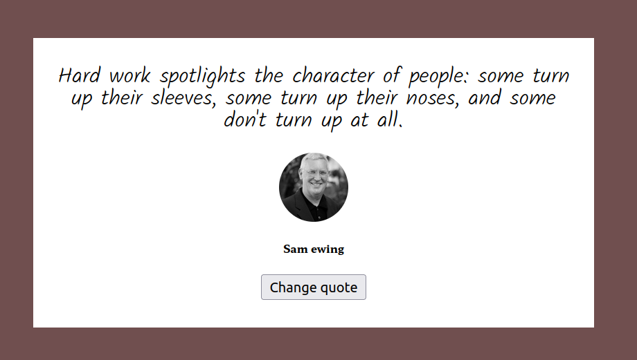

# random-quote-using-async-await
Becode exercise 17 : consume a web service using async/await : Make an asynchronous request to a remote server via javascript using async/await and try/catch.

## Briefing
[Instructions](https://github.com/becodeorg/CRL-KELLER-6/blob/main/1.TRAIL/2.The-Hill/1.DOM/12.Asynchrone/randomQuote.md) for the exercise.

## Printscreen

## Used languages
HTML, CSS, JavaScript

## Authors
Virginie Dourson

## Date
10/2023

## Progression
End of work

## Github page
https://vdourson2.github.io/random-quote-using-async-await/

